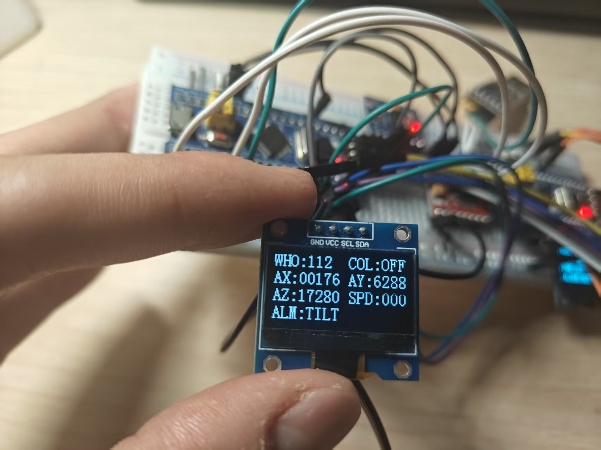
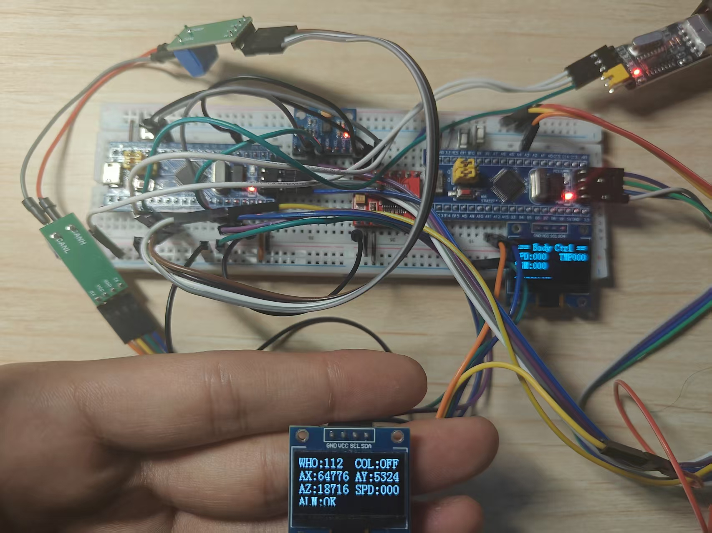

# EdgeGuard-Inertial-AI

基于 STM32F103C8T6 + MPU6050 的 **车姿态边缘 AI 异常检测系统**。
在自研的 STM32 + CAN + FreeRTOS 分布式车身控制系统基础上，为 B 板加入边缘智能：
读取六轴传感器 → 滑窗特征提取 → 决策树推理 → 启发式规则融合 → OLED 实时告警。

打通 **数据采集 → Python 训练 → 量化导出 → MCU 纯 C 推理** 的完整边缘 AI 落地链路。

---

## 一、项目背景

- 这是在已有的 **STM32 + CAN 分布式车身控制系统**（A/B 两板跨节点 CAN 通信，FreeRTOS 多任务）
  基础上升级的子项目。本项目聚焦 B 板的**异常姿态识别**。
- 目标是让板子自己判断当前姿态：**放平 / 倾斜 / 晃动（跌落）**，并在 OLED 上实时显示。

## 二、技术栈

| 类别 | 内容 |
|------|------|
| 主控 | STM32F103C8T6（标准外设库 SPL） |
| 实时系统 | FreeRTOS |
| 传感器 | MPU6050（六轴：加速度 + 角速度） |
| 通信 | CAN 总线（500kbps）/ UART 串口调试 / I2C |
| AI | Python + scikit-learn（决策树），量化后纯 C 移植 |
| 显示 | OLED（I2C） |
| 工具链 | Keil MDK 5 / Python 3 |

## 实物效果

**B 板 OLED 显示倾斜状态（ALM:TILT）**，ay 轴加速度随倾斜显著变化：



**A/B 双板整体连线**：两块 STM32F103C8T6 + CAN 收发器 + MPU6050 + OLED，
CAN 总线跨板通信，B 板 OLED 显示当前姿态：



## 三、边缘 AI 核心链路

### 1. 数据采集（`EdgeGuard/collect_data.py`）
- 通过 UART 串口接收 B 板吐出的 MPU6050 原始六轴数据（ax/ay/az/gx/gy/gz）。
- 分正常 / 异常两类保存为 CSV，作为训练样本。

### 2. 特征提取（`EdgeGuard/feature_extract.py`）
- 滑窗 **20 帧**，步长 5，对齐 MCU 端窗口。
- 每窗口计算 6 通道的 **均值 / 方差 / 峰峰值**，共 **18 维**特征。
- 与 MCU 端 `ml_model.c` 的特征提取方式完全一致，保证训练/推理一致性。

### 3. 模型训练（`EdgeGuard/train_model.py`）
- 用 scikit-learn 训练**决策树**分类正常/异常。
- 输出树的遍历结构、切分阈值、标准化参数，并**自动生成 C 数组**（`tree_data.c`）。

### 4. MCU 端推理（`can-B板/Hardware/ml_model.c`）
- 纯 C 实现：环形缓冲 → 特征提取 → 标准化 → **决策树遍历推理**。
- 无浮点依赖的轻量实现，Flash 占用极小。
- 配合 **启发式规则**（物理阈值）做多级融合判断，兼顾实时性与抗误报。

### 5. 实时告警（`can-B板/User/main.c`）
- OLED 实时显示三态：`OK` / `TILT`（倾斜）/ `SHK`（晃动）。
- 异常状态可扩展经 CAN 上报 A 板（本版为 OLED + 串口）。

## 四、姿态判定逻辑（`ml_model.c` `heuristic_classify`）

判定顺序：**猛晃 > 倾斜 > 中轻震动 > 正常**

```
1.  角速度方差 > SHAKE_VAR_HARD(3000万)   → SHAKE（猛烈晃动/跌落）
2.  最近6帧水平分量 或 陀螺仪单向净转动超阈值 → TILT（倾斜，含快速倾斜）
3.  角速度方差 > STATIC_VAR_LIMIT(50万)    → SHAKE（中轻度震动）
4.  其余                               → OK（正常）
```

关键点：
- **快速倾斜识别**：用「最近几帧陀螺仪均值」判断"单向净转动"（倾斜是往一个方向转，晃动是来回振荡），即使角度变化快也能第一时间判 TILT。
- **决策树与规则融合**：规则判异常直接信；规则判正常时需树**连续 3 帧**都判异常才升级，去抖防单帧误报。

## 五、关键参数（Z轴加速度方向：平放 az ≈ +18700 为基准）

| 参数 | 值 | 含义 |
|------|-----|------|
| `ML_WINDOW_SIZE` | 20 | 滑窗帧数（约 1 秒） |
| `ML_STRIDE` | 5 | 每 5 帧推一次 |
| `ML_FEATURE_COUNT` | 18 | 特征维度 |
| `TILT_H_LIMIT` | 4000 | 水平分量平方阈值（判倾斜） |
| `SHAKE_VAR_HARD` | 30000000 | 角速度方差>此=猛烈晃动/跌落 |
| `STATIC_VAR_LIMIT` | 500000 | 角速度方差>此=中轻震动 |
| `GY_MEAN_TILT_LIMIT` | 500 | 最近6帧陀螺仪均值（单向转动） |
| `RECENT_WINDOW` | 6 | 倾斜快速通道用最近帧数 |

> 以上阈值均依据实测数据标定，非凭空设定。Z轴朝上静止时 gy 方差约 10，倾斜约 26 万，猛晃高达 1 亿以上。

## 六、调试踩坑（过程回顾）

1. **平放也判倾斜且无法恢复**：全窗口 ax/ay 均值在板子放平瞬间仍残留变化。改为只取**最近几帧的水平分量平方(ax²+ay²)**做倾斜判定，放平后立即恢复正常。
2. **快速倾斜与猛晃在方差上重叠**：两者角速度方差都很大，单看方差分不开。通过分析**陀螺仪方向特征**（晃动=往复振荡，倾斜=单向偏转）区分，为倾斜加"快速通道"。
3. **猛晃被误判成倾斜**：猛晃时最近几帧陀螺仪均值偶然偏大。在倾斜判定前先加**角速度方差一票否决**（>3000万直接判猛晃）。

## 七、目录结构

```
EdgeGuard/                  # PC 端 AI 训练链路（Python）
├── collect_data.py         # 串口采集传感器数据 → CSV
├── feature_extract.py      # 滑窗特征提取 → numpy
├── train_model.py          # 决策树训练并导出 C 数组
├── dataset/                # 训练数据 (.npy)
├── data/                   # 原始 CSV 样本
└── model/
    └── tree_data.c         # 生成的 C 模型文件

can-B板/                    # STM32 边缘 AI 工程
├── User/
│   └── main.c              # FreeRTOS 任务 + ML 推理调用
└── Hardware/
    ├── ml_model.c/.h       # 特征提取 + 决策树推理 + 启发式分类
    ├── tree_data.c         # 决策树参数（C 数组）
    ├── MPU6050.c/.h        # 六轴传感器驱动（I2C）
    ├── MyI2C.c             # 软件 I2C
    ├── MyCAN.c/.h          # CAN 总线驱动
    ├── can_protocol.c/.h   # CAN 应用层协议（校验和）
    ├── OLED.c              # OLED 显示（I2C）
    └── PWM.c / Motor.c / Key.c  # 其余外设

can-A板/                    # STM32 CAN 发送端工程（背景项目）
```

## 八、如何运行

### PC 端训练
```bash
cd EdgeGuard
python collect_data.py      # 采集样本（接 B 板串口）
python feature_extract.py   # 提取特征
python train_model.py       # 训练并导出 C 数组
```
把生成的 `tree_data.c` 放到 `can-B板/Hardware/` 下替换，重新编译。

### MCU 端
- Keil MDK 打开 `can-B板/Project.uvprojx`，编译下载到 B 板。
- 上电后 OLED 显示姿态状态；异常时串口输出 `!!! DETECTED ABNORMAL subtype=X !!!`。

> 硬件连接：B 板 PA11/PA12（CAN）、MPU6050 接软件 I2C 引脚、OLED 接 I2C、UART 接串口。

## 九、免责与说明

- 明确说明：本项目决策树使用 scikit-learn 训练，**当前树深度较浅、主要特征为角速度方差**，
  实际姿态主判断依赖**手调阈值的启发式规则**（真实数据标定），决策树作为机器学习要素承担兜底与融合。
- 欢迎对阈值、树深度做进一步调优。

## 联系方式

- GitHub：https://github.com/z3063254283-a11y/EdgeGuard-Inertial-AI
- 邮箱：z3063254283@gmail.com